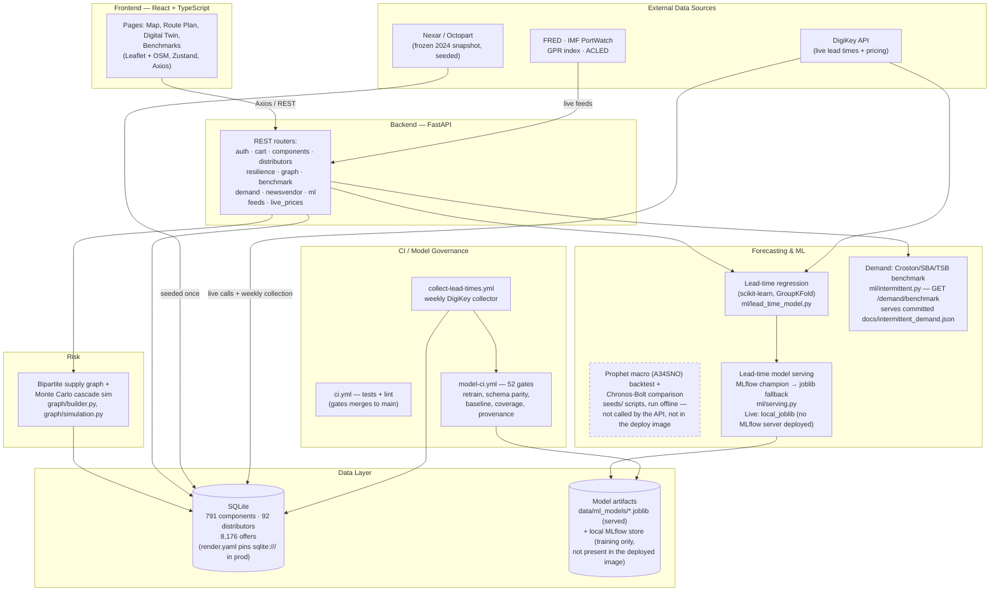

# Supply Chain Optimizer - vehicle routing engine

[](https://github.com/alessiopagliarulo/supply-chain-optimizer/actions/workflows/ci.yml)

A capacitated vehicle routing engine with time windows (CVRPTW), with a web app on top.
One data model, three solver paths and one shared validator live in
[`backend/app/vrp/`](backend/app/vrp/__init__.py):

- **CP-SAT** (exact) - an OR-Tools CP-SAT model that can prove optimality on small instances;
- **OR-Tools routing** - guided local search, the general-purpose path;
- **Clarke-Wright savings** - one fast greedy pass, the baseline.

Every plan, whichever solver produced it, is re-checked by the same validator (capacity,
time windows, fleet size) before it is shown. `method="auto"` uses CP-SAT up to
`EXACT_MAX_CUSTOMERS` customers and OR-Tools routing above that.

On top of the solvers:

- **Simulation** - a SimPy discrete-event simulation stresses a plan with random travel
  and service times, and a buffer tuner searches schedule and capacity buffers.
- **Solomon benchmark** - all 56 Solomon instances at 25, 50 and 100 customers, each solver
  scored against the published best-known values (Solomon's proven optima for 25/50,
  SINTEF's best known for 100), written to the committed
  [`docs/benchmark_results.json`](docs/benchmark_results.json) by
  `backend/scripts/benchmark_solomon.py`.

> **Sourcing work archived.** This repo began as an electronics-component sourcing
> platform. That optimizer (the sourcing MILP, the stochastic program with its CVaR
> frontier, and their pages) was removed and is preserved at git tag
> [`archive/sourcing-v1`](https://github.com/alessiopagliarulo/supply-chain-optimizer/tree/archive/sourcing-v1).
> Some sourcing-era backend analytics (demand-method benchmark, macro regime model,
> network resilience, live risk feeds) still ship API endpoints with no page; the
> sections further down that describe them are about that backend code, not the web app.

---

> ### ▶ Live demo - [supply-chain-ui-bhwz.onrender.com](https://supply-chain-ui-bhwz.onrender.com)
>
> API reference (Swagger): **[supply-chain-api-qy8x.onrender.com/docs](https://supply-chain-api-qy8x.onrender.com/docs)**
>
> No signup and no login - the landing page links straight to the four pages.
> **The page loads instantly. The first *data* request may take 50-120 s.** The UI is a
> Render static site and never spins down; the API is a Render free-tier web service that
> sleeps when idle, so the first call after a quiet spell waits for it to wake. Each page
> shows an amber *"Free-tier backend is waking up"* banner after 3 seconds until the
> response lands.

**Live demo flow:** Map (every real distributor at its real location) -> Route Plan (truck routes between real places, drawn on the map; or a Solomon test case) -> Digital Twin (coming next; today it stress-tests a solved plan and tunes buffers) -> Benchmarks (every solver on every Solomon instance).

---

## Sourcing-era backend analytics (no page)

Two results from the sourcing era, each produced by a command in this repo and written down
in a committed JSON artifact. `tests/test_docs_match_artifacts.py` regenerates each linked
document's `<!-- GENERATED: -->` regions from its artifact and fails on any difference; the
restatements here are hand-written and were checked against the artifacts on 2026-09-07.

- **Intermittent-demand benchmark - 2,646 real spare-parts series**, where `zero` (forecast
  nothing) ranks **1st of 6 by MASE** and 4th-5th of 6 under proper scoring rules; Kendall's
  τ between the MASE and pinball orderings is **−0.20**, i.e. mildly *anti*-correlated.
  → [docs/INTERMITTENT_DEMAND.md](docs/INTERMITTENT_DEMAND.md)
- **Macro supply-stress regime model - 219 walk-forward folds** (2008-2026), Brier
  **0.393** against persistence 0.539 and climatology 0.673, calibration slope 0.629.
  **It ties persistence on accuracy - 0.7306 vs 0.7306** - and ships anyway, because
  accuracy is not the gate: the model's consumer prices a probability, and persistence can
  only ever emit 0 or 1. → [docs/MODEL_CI.md](docs/MODEL_CI.md)

The component data behind the sourcing work is a frozen 2024 snapshot (791 components,
92 distributors, 8,176 price offers, originally collected via the Nexar API and
redistributed on HuggingFace under CC-BY-4.0), not a live feed
([docs/DATA_PROVENANCE.md](docs/DATA_PROVENANCE.md)).

| Feature | Technical approach |
|---------|-------------------|
| Network fragility | Graph ML: Fiedler algebraic connectivity, betweenness centrality, HHI, k-core decomposition |
| Resilience scenarios | Distributor failure cascade, geopolitical risk overlay, delivery target optimization |
| Demand-method benchmark | Croston/SBA/TSB scored on CRPS + scaled pinball loss, not just MASE, across 2,646 Monash car-parts series - MASE and proper scoring pick different winners |
| Live risk feeds | IMF PortWatch port congestion and FRED freight indices (live, actively published); GPR index (downloaded live on a 15-min tick, but the published archive's newest observation is **September 2021** - `/feeds/status` now reads the observation date, not just the download time, and reports it `stale` with the date rather than `live`); ACLED conflict data (needs a key, labelled `inactive` without one) |

---

## Dollar-denominated impact

Every headline metric is paired with a concrete financial interpretation, derived
from real computed quantities — never an invented figure. The conversions are
surfaced live in the dashboard (resilience banner, holding-cost tooltips) and
summarized here.

| Metric | Where it comes from | Dollar translation |
|--------|---------------------|--------------------|
| **CVaR-95** (tail-risk) | Mean emergency-procurement cost multiplier over the worst-5% of 1,000 Monte Carlo cascade scenarios (`graph/simulation.py`) | **"$X of procurement spend at risk"** = real baseline BOM spend × (CVaR-95 − 1). Computed per BOM in `resilience.py` (`procurement_spend_at_risk_usd`); no page shows it since the web app shrank to three pages. **Caveat — read this before trusting the number:** the *spend* side is real, and the *probability* side is now calibrated, not proxied. Distributor failure probability is anchored to a cited base rate — McKinsey Global Institute (Aug 2020): disruptions lasting a month or longer roughly every 3.7 years — converted to an annual Poisson rate and then to a probability over a 60-day purchase-order exposure window; betweenness centrality only rank-orders *relative* risk around that base rate (`centrality_spread=1.0` removes centrality's effect entirely), and every probability is capped at 50%. On the live headline BOM this puts calibrated `p_fail` between 1.45% and 13.04% across its six suppliers — it no longer saturates near a fixed number. What's still assumed, not measured: the McKinsey rate is firm-level, so applying it to one distributor is almost certainly too high, and nothing establishes that centrality actually predicts disruption likelihood (the code names this and supports `spread=1.0` precisely because of it); the model is `app/graph/disruption.py`. |
| **Forecast WAPE** (macro backtest, kept) | Walk-forward backtest (3 rolling origins, 12-month horizon) on Census M3 `A34SNO` (Manufacturers' New Orders: Computers & Electronic Products), 198 monthly obs, **pinned to ALFRED vintage 2026-08-16**: Prophet **3.13%** vs seasonal-naive **4.80%** — skill score **+34.8%**. Under the **real-time protocol** — each origin trained only on the vintage that existed on its date, because Census revises this series *in place* — Prophet is **4.13%** vs naive **5.87%**, skill **+29.6%**. The revised-data figures are optimistic by ~24%; the real-time pair is the number you could actually have achieved, and it is the one to quote ([docs/FORECAST_BACKTEST.md](docs/FORECAST_BACKTEST.md)) | **No dollar translation.** This number used to feed a "≈N weeks of safety stock" tooltip on a per-part forecast — that forecast is gone (its magnitude was `total_stock/52 × risk_score`, inferred from inventory, not measured), and the safety-stock dollar figure went with it rather than being carried over with no live consumer. The macro WAPE above is real and stands on its own as a Prophet-vs-naive comparison on an aggregate industry series; it says nothing about per-part accuracy. **What now measures demand-forecast quality:** an intermittent-demand method benchmark on 2,646 Monash car-parts series — MASE ranks the degenerate `zero` forecast 1st (mean rank 1.66) while proper scoring ranks it 4th on CRPS / 5th on scaled pinball loss, and `tsb` wins both (Friedman p < 1e-300). See [docs/INTERMITTENT_DEMAND.md](docs/INTERMITTENT_DEMAND.md). That benchmark doesn't translate to dollars yet — connecting it to a purchasing decision is open work ([docs/archive/ML_API_PUSH_PLAN.md](docs/archive/ML_API_PUSH_PLAN.md) §1.4). |

### Conversion assumptions & citations

- **Inventory carrying cost = 25%/yr.** Reused from the existing cost-model constant
  `ANNUAL_HOLDING_RATE = 0.25` (`backend/app/optimization/costs.py`), cited to
  **Gartner IT Supply Chain Benchmarks 2022** (electronics annual holding rate). Industry
  ranges are typically 20–25%/yr (Richardson, *Harvard Business Review*; APICS).
- **Service level z = 1.645** (95%, one-sided normal) for the safety-stock buffer.
  WAPE is used as a σ/μ forecast-error proxy over the planning horizon — a standard
  textbook safety-stock framing (Silver, Pyke & Peterson, *Inventory Management and
  Production Planning*).
- **CVaR-95 → dollars: the spend side is real, and the probability side is now
  calibrated against a cited base rate — precisely which parts, and which parts
  are still assumed.** The *spend* side is real: it multiplies by the real BOM
  spend (sum of each line's average real offer price). The *probability* side
  (`graph/disruption.py`) starts from McKinsey Global Institute (Aug 2020):
  "companies can now expect supply chain disruptions lasting a month or longer to
  occur every 3.7 years," treated as a Poisson rate and converted to a probability
  over the 60-day purchase-order exposure window. Betweenness centrality
  (`graph/simulation.py`) only rank-orders *relative* risk around that calibrated
  base rate — the most central supplier gets `spread`× it, the least central gets
  1/`spread`×, capped at 50% — and `centrality_spread=1.0` (centrality ignored
  entirely) is a supported setting. On the live headline BOM
  this gives calibrated `p_fail` of 1.45%–13.04% across the six suppliers, not a
  saturated constant. What's still an assumption, not a measurement: the McKinsey
  rate is firm-level, not per-supplier, so applying it to a single distributor is
  almost certainly too high; and nothing establishes that centrality actually
  predicts disruption likelihood at all (arguable either way — the code names this
  explicitly and supports `spread=1.0` because of it). Earlier drafts of this
  README called the pre-calibration version "fully data-derived," which was an
  overstatement that was corrected; this is the current, calibrated state.

### What this model can't do

Stated up front, because an interviewer will find these anyway and it is better that
they hear it from me:

- **There is no per-part demand forecast in this app, and there wasn't a good one
  before.** It used to compute `total_stock / 52 × risk_score` and call the result
  "demand," then fit Prophet on top — a magnitude *inferred from inventory position
  and a risk multiplier*, not measured, and identical in shape across all 791 parts.
  The forecast window it produced also closed 17 months before this line was
  written, against which no actuals were ever recorded — unscoreable even in
  principle. It was removed rather than patched (migration
  `0008_drop_synthetic_demand_tables.py`), because no public per-SKU demand series
  exists for electronic components. The Census `A34SNO` backtest above is real and
  unaffected by the deletion — it never depended on those tables — but it measures
  an aggregate industry series, not this app's parts, so the 3.13% WAPE (4.13%
  under the real-time protocol) is still not evidence about per-part accuracy.
  What replaced the per-part claim is a method
  benchmark on a real intermittent-demand panel (Monash car parts) — see the
  demand-method row above and [docs/INTERMITTENT_DEMAND.md](docs/INTERMITTENT_DEMAND.md).
- **Disruption probabilities are structural, not empirical** (see the CVaR caveat above).
- **The lead-time panel is 4,148 real observations across seven snapshot dates**
  (75 on 2026-07-01, 742 on 2026-08-15, 363 on 2026-08-17, 742 on 2026-08-24, 742 on 2026-08-31, 742 on 2026-09-07, 742 on 2026-09-14), all from DigiKey — one distributor, not a cross-distributor consensus. 791
  of 791 parts were polled on 2026-08-15; 6.2% missed (43 not in DigiKey's catalog, 6 in
  the catalog with no published lead time), and that miss list is in
  `seeds/data/lead_time_panel/collection_log.csv`.
- **The served lead-time model is one snapshot behind the panel, and that gap is
  published rather than hidden.** The collector runs weekly; the model is retrained by
  hand, so the two drift apart between retrains. The deployed artifact was trained
  **2026-09-03** on the **2,615** usable rows of the then 2,664-row, five-snapshot cut of
  the panel, with **324** features — every `2,615` / `472` / `28` / `324` figure below
  describes *that artifact*, not the panel on disk today.
  `GET /api/v1/ml/model-info` publishes both sides: the training count, and a
  `training_data_staleness` block that compares the panel sha256 the artifact recorded at
  fit time (`c68e2891…`) with the file on disk (`d94df904…` since the 2026-09-07
  collector run). They differ, so it currently reports `stale: true` and names the
  retrain command. The tripwire is deliberately a warning and not a build failure, so a
  scheduled collector commit cannot turn CI red by itself.
- **Any lead-time R² must come from a *grouped* split, not a random one.** The dataset
  contains large near-duplicate part families (456 STM32F103 rows, 147 ATMEGA328),
  and `base_product` alone explains **R²=0.856 of the target in sample** (361 levels
  over 2,615 rows — an in-sample identity-column figure, not a model score and not
  cross-validated). A random split therefore scores memorization of a part family, not
  prediction. Measured over 50 folds — same estimator, same 2,615 rows, same feature
  pipeline, only the grouping changes (all four figures below are properties of the
  **2026-09-03 artifact vintage** described above — 2,615 rows, 5 snapshots):

  | Split regime | R² mean | R² median |
  |---|---:|---:|
  | random rows (**the wrong protocol**) | **+0.825** | +0.826 |
  | `GroupKFold` by part family (**472 family grouping keys**) | **+0.073** | +0.140 |
  | `GroupKFold` by manufacturer | **−0.697** | −0.104 |

  The effective sample size for generalization is **28 manufacturers, not 2,615 rows**.
  A negative R² on held-out manufacturers means the model's squared error exceeds
  that vendor's whole label variance — no explanatory power at all on a vendor it has
  never quoted. The family split groups on the same `_group_key` the shipped model
  uses — `base_product` where it exists, MPN or row otherwise — which is **472
  grouping keys**, not the 361 raw `base_product` levels quoted above for the
  in-sample identity check; the two numbers count different things and both come from
  `docs/leakage_progression.json` (`counts.n_family_group_keys` = 472,
  `identity_column_in_sample_r2.base_product.n_levels` = 361) and from the served
  `metrics.joblib['lead_time_leakage_audit']['n_families']` = 472. Grouped by part
  family is the only split I would defend, and even that one is optimistic relative to
  how the model is deployed. (An earlier revision
  of this table quoted an 810-row, 27-manufacturer, `random_forest` vintage — R²
  +0.638 / +0.082 / −0.550 — that two retrains had already superseded by 2026-08-26;
  those numbers are retired.) The served artifact
  (`metrics.joblib['lead_time_leakage_audit']`, 20 repeated `GroupShuffleSplit`
  holdouts rather than 50 `GroupKFold` folds) reports the same collapse on the same
  2,615 rows: +0.8341 → +0.1255 → **−0.4422**, and that is the figure
  `GET /api/v1/ml/model-comparison` serves. Full protocol, per-fold scores and the
  naive baselines on identical folds:
  [docs/LEAKAGE_PROGRESSION.md](docs/LEAKAGE_PROGRESSION.md) /
  [docs/leakage_progression.json](docs/leakage_progression.json), regenerated with
  `cd backend && python -m seeds.run_leakage_progression`.
- **Prices are a frozen 2024 snapshot**, so nothing here reflects today's market.

See [docs/IMPACT_FRAMING.md](docs/IMPACT_FRAMING.md) for the full derivations.

---

## Quick Start (no Docker required)

Nothing to install if you just want to look: use the **[live demo](https://supply-chain-ui-bhwz.onrender.com)** above.
To run it locally, see **[QUICK_START.md](QUICK_START.md)** for step-by-step setup.

**TL;DR:**
```bash
# Terminal 1 — backend
cd backend && source venv/bin/activate
python -m uvicorn app.main:app --reload --port 8000

# Terminal 2 — frontend
cd frontend && npm run dev
```

Open http://localhost:5173 and pick a page. There is no login.

---

## Tech Stack

**Backend:** Python 3.11 · FastAPI · SQLAlchemy · SQLite (dev **and** current production — `render.yaml` pins `DATABASE_URL=sqlite:///./supply_chain.db`; PostgreSQL support exists in the SQLAlchemy layer via `psycopg`, but nothing is deployed on it) · OR-Tools · NetworkX · scikit-learn (Prophet is installed and used by the offline `seeds/` backtests; no API route imports it)  
**Frontend:** React 19 · TypeScript · Vite · Tailwind CSS v4 · Recharts · Zustand  
**Algorithms:** Monte Carlo simulation, Spectral Graph Theory, TSP (kept for the routing rebuild)  
**Data:** Nexar/Octopart static 2024 snapshot (real component pricing), DigiKey API (4,148 real observed lead times + live pricing), Nexar & OEMsecrets live pricing, FRED and IMF PortWatch (live), GPR index (downloaded live, but the published archive's newest observation is **September 2021** — see the feeds note below), ACLED (needs a key — reports as inactive without one)

---

## Architecture

```
frontend/src/
  pages/          Landing, Map, RoutePlan (RealPlacePlanner + SolomonPlanner tabs), DigitalTwin, Benchmarks, NotFound
  components/     NavBar, RoutePlot (x/y route plot + legend), map/ (plain Leaflet + OpenStreetMap: BaseMap,
                  SiteLayer clusters, RouteLayer, DistributorSearchBar), SnapshotNotice, ui, ErrorBoundary, WakeNotice
  lib/            customerCsv (upload format), benchmarks (artifact reader), sites (map grouping),
                  latestRun (newest-request-wins solve bookkeeping), colors
  store/          Zustand: planStore (the solved plan Route Plan hands to Digital Twin)
  services/       api.ts (Axios client: /routing, /routing/places, /distributors, /catalogue), catalogue.ts
frontend/scripts/
  ui-gate.cjs     the automated browser gate (see Tests)
  screenshots.cjs regenerates docs/screenshots/current/

backend/app/
  api/            FastAPI routers: auth, cart, components, distributors, resilience, graph,
                  benchmark, demand, newsvendor, ml, feeds, live_prices
  optimization/   OR-Tools pickup TSP, cross-dock hub selection, freight/carbon costs,
                  newsvendor, resilience recommendations
  graph/          NetworkX bipartite supply graph, Fiedler curve, centrality metrics,
                  calibrated disruption probabilities
  feeds/          Live data fetchers: GPR, ACLED, IMF PortWatch, FRED freight
  ml/             Prophet macro (A34SNO) backtest + Chronos comparison, sklearn lead-time
                  prediction, FRED regime model, intermittent-demand method benchmark
                  (Croston/SBA/TSB, shared rolling-origin protocol)
  cache.py        SHA256-keyed scenario cache, 1h TTL, background cleanup
  supply_chain.db SQLite — 791 components, 92 distributors, 8,176 price offers (real data)
```



Lead-time and demand-forecast training runs are tracked with MLflow (params, real backtest metrics, model artifacts, champion promotion) — 21 runs across 2 experiments. The regime model and the newsvendor/leakage scripts write committed JSON artifacts instead — see [docs/MLFLOW.md](docs/MLFLOW.md).

---

## Web app

Four pages plus a landing page, no login. Every view of catalogue data says it is a
frozen 2024 snapshot, with the year read from `GET /catalogue/provenance`.

- **Map** (`/map`) - every located distributor at its real coordinates on free
  OpenStreetMap tiles (Leaflet, no API key), clustered where many share a city (the
  Shenzhen group is one marker of 29). Click one for its city, country, what it carries
  (categories and largest stock lines) and a link to plan routes from it.
- **Route Plan** (`/route-plan`), **Real places** tab - pick a real depot and
  destinations, plan truck routes with the CVRPTW engine on great-circle distance x 1.3
  (the road factor), and see them on the map with per-truck colours, a legend, distance,
  trucks and runtime. Loads, trucks and hours are a labelled example scenario: the
  catalogue has no orders. See [docs/REAL_PLACE_ROUTING.md](docs/REAL_PLACE_ROUTING.md).
- **Route Plan**, **Solomon test cases** tab (`/route-plan?source=solomon`) - pick a built-in sample (real Solomon C101 and R101,
  25-customer versions; see `backend/app/vrp/data/samples/README.md`), any Solomon
  benchmark file present in `backend/app/vrp/data/solomon/`, or upload a customer CSV
  (header `x,y,demand,ready,due,service_time`, depot first). Choose a solver, solve, and
  see each route on an x/y plot with distance, vehicles, feasibility and runtime.
- **Digital Twin** (`/digital-twin`; `/simulation` redirects there) - labelled "coming
  next": the twin of the real network is a later task. Today it runs the current plan through the SimPy
  discrete-event simulation (on-time rate, lateness mean and p95, completion against
  depot close, utilization), then tune schedule and capacity buffers and see the
  evaluated frontier.
- **Benchmarks** (`/benchmarks`) - the committed `docs/benchmark_results.json`, as a
  sortable table and a gap-vs-runtime chart per solver, filterable by instance size, with
  its provenance. Sizes with no published reference show "not published", never a number.
  SINTEF's 100-customer best known ranks fewest vehicles first, so a distance gap is only
  shown when the solver used the same number of vehicles; other rows show the vehicle gap
  and "not comparable".
  The page's reader is tested against the real artifact (`npm test` in `frontend/`).

The lead-time model and resilience code stay in the backend and keep their API
endpoints; they no longer have pages.

Screenshots of every page: [`docs/screenshots/current/`](docs/screenshots/current/)
(regenerate with `npm run screenshots`; `_manifest.json` records the commit and URL).

---

## Key API Endpoints

```
POST /api/v1/auth/demo                       # one-click demo login
GET  /api/v1/components                      # 791 real electronic components
GET  /api/v1/distributors                    # 92 distributors with city coordinates (filters: country, component_id, category, bbox, located_only)
GET  /api/v1/distributors/{id}/components     # every component a distributor carries, with its 2024 offer
GET  /api/v1/catalogue/provenance            # what the catalogue is: frozen 2024 snapshot, not live; coordinate precision
GET  /api/v1/graph/metrics                   # Fiedler value, centrality, HHI, k-core
POST /api/v1/resilience/distributor-failure  # simulate distributor outage -> cost/ETA/risk delta
POST /api/v1/resilience/geopolitical-risk    # what-if risk-score stress dial (reads no live feed)
POST /api/v1/resilience/delivery-target      # "who can hit 14 days?" -> supplier capability list
GET  /api/v1/ml/stress                       # macro supply-stress regime model (219 walk-forward folds, Brier 0.393)
GET  /api/v1/ml/model-info                   # served lead-time artifact provenance + training_data_staleness
GET  /api/v1/demand/benchmark                # intermittent-demand method benchmark (Croston/SBA/TSB, CRPS+MASE, Monash car parts)
GET  /api/v1/feeds/status                    # feed freshness: download date, plus observation date where the feed publishes one (today: GPR)
GET  /api/v1/benchmark/fiedler-curve         # sequential-removal Fiedler λ₂ curve
GET  /api/v1/routing/instances               # built-in samples + Solomon files, and the request caps
GET  /api/v1/routing/instances/{id}          # one named instance: coordinates, nodes, fleet
POST /api/v1/routing/solve                   # CVRPTW route plan (CP-SAT exact, Clarke-Wright, OR-Tools routing), validated
POST /api/v1/routing/simulate                # SimPy DES of a route plan: on-time rate, lateness, completion, utilization
POST /api/v1/routing/tune-buffers            # Buffer-tuning optimization: find schedule/capacity buffers balancing on-time rate against cost/slack via DES simulation
GET  /api/v1/routing/benchmarks              # docs/benchmark_results.json as committed, or available: false
```

Full API reference (live Swagger UI): **https://supply-chain-api-qy8x.onrender.com/docs** — or http://localhost:8000/docs when running locally  
Scenario API reference: [docs/archive/SCENARIO_API.md](docs/archive/SCENARIO_API.md)

---

## Tests

### Backend

```bash
cd backend
./venv/bin/python -m pytest tests/ -q
```

**Measured 2026-09-08 on the committed database with `-n auto --dist loadfile`:
`1 failed, 1335 passed, 4 skipped` in 496 s.** The parallel flags change the selection not
at all (verified node id by node id on 2026-09-05), so the serial command above reports the
same outcomes and takes about three times as long. `ci.yml` runs `-m "not slow"`, which was
`1331 passed, 3 skipped, 0 failed` in 527 s. The `Repo — Tests` workflow
(`.github/workflows/repo-tests.yml`) runs the whole suite with no `-m` filter on a macOS/arm64
runner, the artifacts' own platform, so the `slow` pins run in CI there too (why they need that
platform: the block comment above section 6 of `backend/tests/test_artifacts_pinned_to_code.py`).
The one red in the 2026-09-08 measurement is named here rather than buried:

| Failing test | Why, and what it means |
| --- | --- |
| `test_artifacts_pinned_to_code.py::test_leakage_progression_reproduces_from_the_live_lead_time_model` | **Went red on data growth, not code drift.** The weekly collector appends a snapshot to the panel every Monday, and the pin compared against the whole live file. It now re-solves on the exact panel bytes the artifact records it was built from, which must be the byte-for-byte head of today's file: an append passes, a rewrite of an already-measured row fails. That the served model has not been retrained on the grown panel is published on `GET /api/v1/ml/model-info` as `training_data_staleness: stale: true` rather than hidden; it is cleared by retraining, **never** by editing an artifact. |

A suite that reported "all passed" while a published figure had stopped reproducing would
be worse than this.

`test_model_ci_gates.py::test_the_served_estimator_is_the_one_the_metrics_describe` used
to stand here as a second, permitted failure — a local-only MLflow registry identity check
that was always green in CI. The 2026-09-03 retrain cleared it and it now passes locally
too, so it is no longer an exception the reader has to hold in their head.

Coverage: routing and cross-dock modules, graph metrics, ML models
and their published-artifact pins, resilience API, auth guards, feed integrations.

### Frontend

The frontend has two automated suites. `npm test` (Vitest) checks the Benchmarks page's
reader against the real committed `docs/benchmark_results.json`, so a row shape the page
cannot read fails there. The main one is a browser gate that runs against the **live
deployment** or a local build:

```bash
cd frontend
BASE=https://supply-chain-ui-bhwz.onrender.com npm run ui-gate
# or: npm run build && npx vite preview --port 4173 &  API=http://localhost:8000 npm run ui-gate
```

It runs on every pull request in `.github/workflows/ui-gate.yml` (the API from the same
commit on the committed database, a production build pointed at it). The last local run
(2026-09-19, with the Map page and real-place routing) was 159 passed, 0 failed. `scripts/ui-gate.cjs` drives a real Chromium over
**every route at 4 viewports** (390 / 768 / 1280 / 1440), solves a plan and simulates it,
checks that every removed sourcing-era path renders the 404 page, and asserts what a human
would otherwise have to notice:

- **horizontal overflow**, measured against the real scroll container — every route renders
  inside `overflow-y-auto`, so `document.scrollWidth` reports a false clean
- **clipped SVG chart labels** — `scrollWidth > clientWidth` never fires on SVG text, which
  is how three clipped axis labels shipped unnoticed
- **chart geometry** (the tallest bar must clear 8px) and **legend-vs-axis-label overlap**
- **chart legend contrast**, hand-rolled by compositing alpha through a 1px canvas, because
  axe-core returns *incomplete* rather than a violation for recharts legend labels
- **axe-core serious/critical** — and deliberately *not* hand-rolled contrast for Tailwind
  colours: Tailwind v4 emits `oklch()`, and a naive rgb parser returned a false clean on 32
  real failures
- **leaked JS placeholders** in user-visible text, **text under 11px** (prose under 12px),
  **touch targets ≥ 44px** (with WCAG 2.5.5's inline-link exemption), emoji in product UI,
  **head tags**, and **console/page errors**
- a route rendering the 404 page **fails** — a missing route trivially passes every other
  check, so without this the gate reports a clean sheet on a dead page

Type-checking and the production build:

```bash
cd frontend
npx tsc -b --force && npm run build
```

> **Use `tsc -b`, never `tsc --noEmit`.** The root `tsconfig.json` is a *solution* file
> (`"files": []` plus `references`), so `tsc --noEmit` typechecks **nothing** and exits 0 on
> any error. Verified again on 2026-09-02 by planting `const x: number = "not a number"` in
> `src/pages/NotFoundPage.tsx`: `npx tsc --noEmit` exited **0**, `npx tsc -b --force`
> reported `error TS2322`. `npm run build` uses `tsc -b`, which is why CI catches what a
> bare `--noEmit` would wave through.

---

## Model CI — gates derived from bugs that actually shipped

A second workflow, [`model-ci`](.github/workflows/model-ci.yml), asks a different
question from `ci.yml`: not *"does the code work?"* but *"is the model fit to
serve?"*. It retrains the lead-time model on the committed observed panel and
fails the build on any of the following. **Every gate is a postmortem, not a best
practice** — each one names a defect that was live in this repo and was found by
hand, never by a test:

| Gate | The bug it prevents |
| --- | --- |
| **Train/serve schema parity** | Training and serving built different feature schemas; the aligner zero-filled the difference, so **every** prediction was the constant 62.1085 days — while `/ml/model-comparison` published R²=0.9291 for a configuration that was never served. |
| **Beats its stated baseline** | `beats_baselines` was computed and the model was persisted regardless of the answer. The regime model shipped at 0.733 accuracy against a 0.833 persistence baseline. Now a losing model is refused *and* any stale artifact is deleted. |
| **Serve-time coverage floor** | Feature admission asked "does this column exist?" instead of "is it ever populated?". Two columns filled on 7.0% of rows were admitted, and the model then declined to predict on 93% of real inputs — false on 6 of 6 sampled optimizer runs. Now ≥80% of real `(offer, component)` pairs must get an answer, measured against the shipped database. |
| **Not a near-constant predictor** | The other half of the schema bug, and the reason it survived: nothing ran the committed artifact over real inputs and measured the spread. Now it does. |
| **Endpoint declares its model's inputs** | The schema grew a `parameter_count` requirement, the `/ml/lead-time` signature did not follow, and FastAPI returned **422 on every call** before the model was consulted. |
| **Artifact carries provenance** | `metrics.joblib` had no `trained_at`, no training-data hash, no row count, no git SHA — so which data produced which model was unanswerable, which is why the R² mismatch went unnoticed. |
| **A gate can't silently stop testing** | A contract test kept passing while testing nothing, because the primary feature was renamed underneath it. Meta-tests now assert the variance tests still vary the model's *actual* primary feature — and `MODEL_CI_STRICT=1` turns a **skipped** gate into a failure, because a skipped gate is a green gate. |

Provenance (`trained_at`, `git_sha`, `sklearn_version`, `training_data_sha256`,
`n_training_rows`, `n_distinct_families`, …) is stamped at fit time and published
at `GET /api/v1/ml/model-info`. A **staleness check** warns — never fails — when
the weekly collector has grown the panel past what the served artifact was
trained on, so that growth is visible rather than silently ignored.

```bash
cd backend
MODEL_CI_STRICT=1 ./venv/bin/python -m pytest tests/ -m model_ci -q
# -> 52 passed, 1288 deselected in 525.67s (0:08:45)
```

**52 gates, all green** — measured 2026-09-08. This block read `1 failed, 50 passed` until
today, describing a local-only MLflow registry identity check that the 2026-09-03 retrain
had already cleared; the number outlived the condition it described, which is the failure
mode this whole section exists to catch.

One of those 52 gates emits a warning rather than a failure right now, and that is by
design: `test_training_data_staleness_is_reported_never_ignored` reports **STALE** —
the served artifact was fitted on the panel at `c68e2891…` and the file on disk is
`d94df904…` since the 2026-09-07 collector run. A scheduled data commit must not be able
to turn the build red by itself, so the tripwire warns, names the retrain command, and the
gap is served on `/api/v1/ml/model-info`. See [Tests](#tests).

Full write-up, including what these gates deliberately do **not** claim:
**[docs/MODEL_CI.md](docs/MODEL_CI.md)**.

---

## Lint & type-check

CI runs a dedicated `backend-lint` job (ruff + mypy) alongside tests, plus `tsc -b`
for the frontend (part of `npm run build`). Config lives in `backend/pyproject.toml`.

```bash
cd backend
source venv/bin/activate
pip install -r requirements-dev.txt   # ruff + mypy, dev-only

ruff check app          # lint (E/F/I/UP/B core rules)
ruff format app --check # formatting — not yet wired into CI (see note below)
mypy app                 # type-check (non-strict)
```

Both `ruff check app` (`All checks passed!`) and `mypy app` (`Success: no issues found in 77 source files`) are green today — re-run 2026-09-18. Deliberately deferred, tracked
in `pyproject.toml` comments so they can be picked up later without fighting
in-flight edits elsewhere in the repo:

- **`ruff format`**: **62 of 77** backend files would be reformatted (`ruff format app
  --check`) — the codebase predates a formatter convention. Not added as a CI gate yet:
  running it would touch nearly every file. Run locally and land as its own PR when
  convenient.
- **Typing-modernization rules** (`UP006`, `UP035`, `UP037`, `UP045` — `List`/`Optional[X]`
  → `list`/`X | None`) and **import sorting** (`I001`): large, repo-wide, low-risk-but-
  noisy sweeps. Ignored in `[tool.ruff.lint]` for now; safe to re-enable and `--fix`
  once other in-flight branches land.
- **Six per-file rule ignores**, in `app/ml/regime_model.py` (`F401`, `B905`),
  `app/ml/lead_time_model.py` (`E402`), `app/ml/serving.py` (`UP017`),
  `app/optimization/recommendations.py` (`F401`), `app/graph/simulation.py` (`B905`) and
  `app/core/clients/oemsecrets_client.py` (`B007`) — small, real lint findings (unused
  imports, `zip()` without `strict=`, an import below the top of the module,
  an unused loop variable, and `datetime.timezone.utc` where `datetime.UTC` now exists),
  left untouched because those files are owned by concurrent work; see
  `[tool.ruff.lint.per-file-ignores]`.
- **mypy** is fully strict-by-default-off (`ignore_missing_imports`, no `--strict`) and
  has a `[[tool.mypy.overrides]]` block that turns off checking for **18** modules — mostly
  `app/api/*` and `app/optimization/*` — where the codebase's untyped SQLAlchemy
  `Column(...)` declarative models (no `Mapped[...]` annotations) produce large numbers
  of `Column[T]` vs `T` false positives rather than real bugs. `mypy app` reports
  `Success: no issues found in 70 source files`, so **52 of those 70** are fully
  type-checked today. Migrating `app/models/*` to SQLAlchemy 2.0 `Mapped[]` typing would
  let those overrides be removed.

---

## The short version

**The 30-second pitch:**

> "Supply chain resilience is a graph problem, so I measured it spectrally — and the
> measurement talked me out of my own thesis. I expected one dominant distributor and a
> network one failure from collapse. What the data actually says: DigiKey is the largest
> single distributor at **11.2%** of offers, not 40%; killing DigiKey outright orphans
> **2** of 791 components (ids 11 and 290 — both DigiKey-only, and both already
> zero-stock there, so nothing sourceable is lost) and moves landed cost by **~0%**,
> because the per-line redundancy
> is genuinely there. The whole-graph Fiedler value is exactly 0.0 — but that's a floor
> by construction, since the graph fragments into 34 components. The number that means
> something is λ₂ = **0.279** on the giant component, which holds **95.9%** of the
> network: moderately connected, not fragile. The real single-point risk is the other
> 4% — **36 nodes** with no path into the main network at all. That's the list worth
> acting on, and it's short."

*(An earlier version of this pitch claimed "DigiKey handles 40% of offers" and "12
components have no alternative source." Neither is true of this data. They are left
documented here rather than quietly deleted, because catching it is the more
interesting story than never having written it.)*

*(Same story, second instance — **2026-09-03**: this pitch read "43 components", "λ₂ =
0.238", "95%" until a self-audit found the graph was being built from **80%** of the
supplier–part links. A deliberate 20% holdout carve (commit `da16157`, 2026-04-16) had
been added as a **leakage guard**, so a planned benchmark phase could not evaluate on
links it had already seen. Four days later, when that benchmark actually landed
(`885f436`, 2026-04-20), it declined to use the holdout — `run_benchmark.py` uses ALL
offers, because the benchmark **is** the holdout evaluation — and the carve then sat
inert for ~4.5 months, silently
excluding **1,574 of 8,176** offers from every published topology figure. Removing it
made the network measurably **less** fragmented, not more: 43 → 34 components, λ₂
0.238 → 0.279, giant component 95.0% → 95.9%. The honest one-line framing: **a leakage
guard for an evaluation step that was later designed not to need it.** The graph now
satisfies an exact invariant that makes this class of silent drop impossible to repeat:
`n_edges + n_duplicate_offer_rows == n_offer_rows` (7,363 + 813 = 8,176).)*

**Key talking points:**
- Fiedler value as a fragility metric — including *why the naive whole-graph reading of it is a trap* on a disconnected graph
- Monte Carlo shows distribution tails, not just means — that's where supply chain risk lives
- Live geopolitical data overlay: PortWatch/FRED/GPR feeds — and the feed panel distinguishes *downloaded recently* from *observed recently*, which is how the GPR archive's frozen September-2021 reading stopped being published as a current one (ACLED is wired but needs a key — the UI labels it "Inactive" rather than faking a healthy feed)

---

## How this was built

Most of the code in this repo was written by AI agents — Claude, running under
`.github/workflows/claude-*.yml` — not by me typing it line by line. I'm not going to
pretend otherwise; the `claude-*.yml` workflows that ran them are public and readable.

What I actually did: framed the problem, decided what to build and in what order,
reviewed every pull request before merging it, and did the verification — including the
audit (archived with the sourcing work at `archive/sourcing-v1`) that found the sourcing
optimizer's 44.7% headline was arithmetically real and substantively meaningless, and
killed it rather than leaving it in. That retraction is the clearest
evidence of what "direction" means here: an agent produced the number, and I'm the one
who checked it, didn't like what I found, and published the correction instead of the
headline.

There's also an autonomous loop running on a schedule — Scout files proposals, Builder
opens PRs against them, an independent Auditor reviews each one, and I'm the only one who
can merge to `main` (see `docs/archive/AUTONOMOUS-LOOP.md`). I keep a running list of that
loop's own failures as a maintainer note — it is not published here — because early runs failed
in ways a green checkmark didn't catch: a run that filed zero issues and still reported success,
subagents killed mid-task when their parent job ended. The specific failures that produced a
standing rule are written into the thing they constrain instead, in the test and workflow
comments, where they cannot rot away from it.

Nothing in this README is asserted on trust. The ML numbers are checked by
CI gates (`model-ci`, [docs/MODEL_CI.md](docs/MODEL_CI.md)) that fail the build rather
than let a bad number ship quietly.

---

## Data Sources

| Source | What it provides |
|--------|-----------------|
| Nexar / Octopart (**static 2024 snapshot**, via HuggingFace `mdnh/electronic-components-supply-chain`, CC-BY-4.0) | Real component pricing, stock levels, distributor offers (791 components, 92 distributors, 8,176 offers). Real data, but a **frozen snapshot** — not a live API feed. See [docs/DATA_PROVENANCE.md](docs/DATA_PROVENANCE.md). |
| DigiKey API (**live**) | **4,148 real observed lead times across seven snapshots** (75 on 2026-07-01, 742 on 2026-08-15, 363 on 2026-08-17, 742 on 2026-08-24, 742 on 2026-08-31, 742 on 2026-09-07, 742 on 2026-09-14), collected from all 791 catalogued components — 6.19% miss rate on the full 2026-08-15 sweep, logged per attempt. The served model is fitted on an earlier cut of this panel (2,615 usable rows of the then 2,664-row, five-snapshot cut, trained 2026-09-03) — see the lead-time bullets above. Collected by [`app/ml/lead_time_collector.py`](backend/app/ml/lead_time_collector.py) (resumable, quota-aware, honours `X-RateLimit-Remaining` and `Retry-After`) and scheduled weekly via [`.github/workflows/collect-lead-times.yml`](.github/workflows/collect-lead-times.yml). Also supplies live pricing/stock through `/api/v1/live-prices/*`. |
| FRED (Federal Reserve) | Freight index, PPI, macro stress regime |
| ACLED | Conflict event counts by country (distributor risk) |
| IMF PortWatch | Port call frequency (congestion delay) |
| GPR Index (**2021 archive snapshot**) | Geopolitical risk index (Chinese-origin component risk). The file at the published URL still downloads on every 15-minute tick, but its newest observation is dated **September 2021**, so the value it yields is a four-year-old reading rather than a current one. `/feeds/status` reads that observation date and reports the feed `stale`, naming the date, instead of `live`. |

---

## License

**MIT** for the code — see [LICENSE](LICENSE).

The bundled electronic-components dataset is licensed separately under **CC-BY-4.0**
(attribution required); the split is documented in
[docs/DATA_PROVENANCE.md](docs/DATA_PROVENANCE.md#licensing--code-vs-data).
